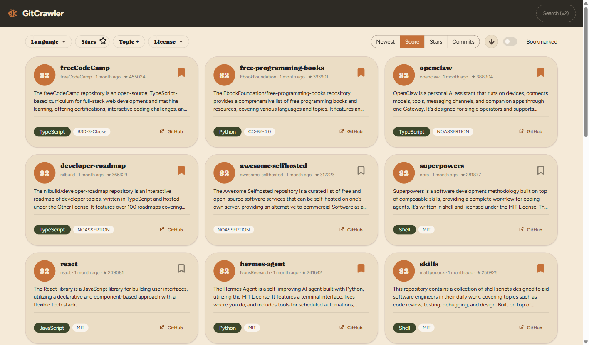
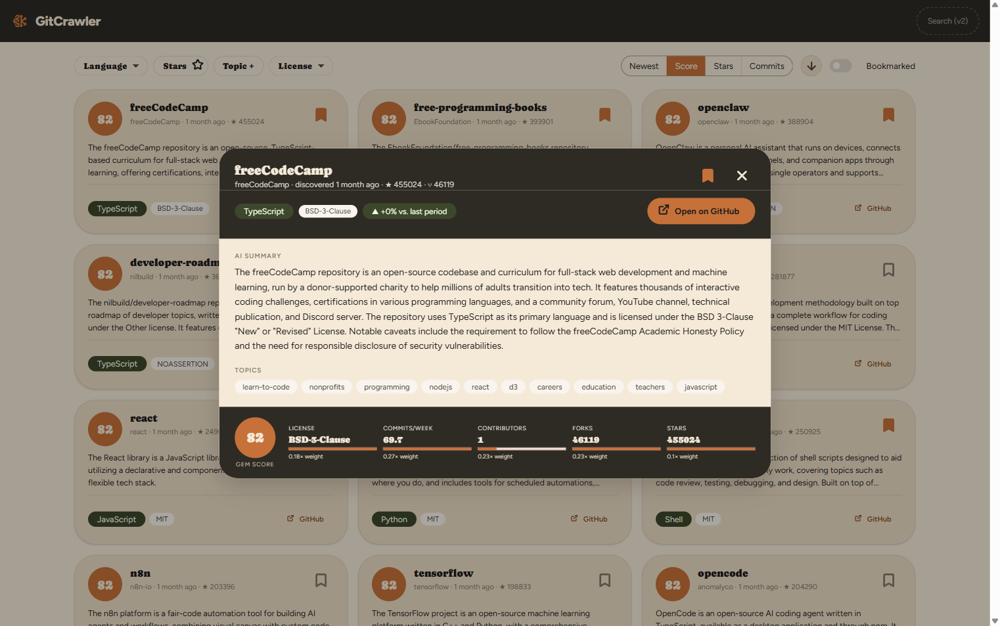
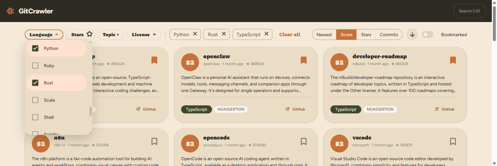
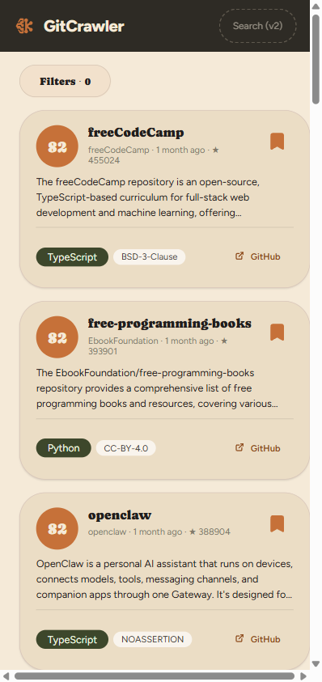
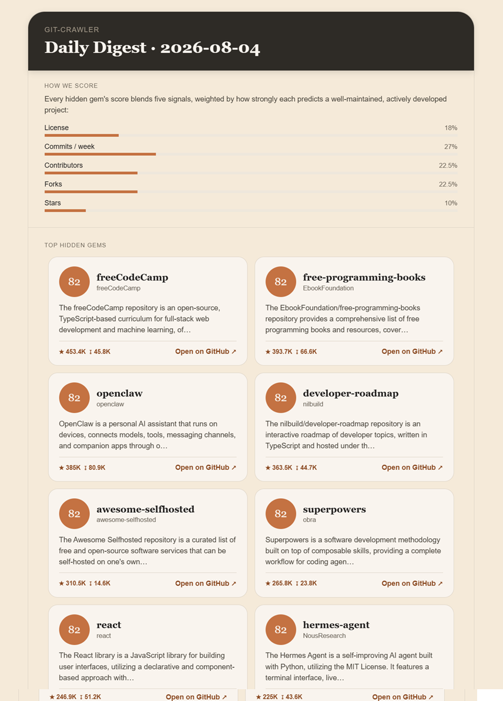
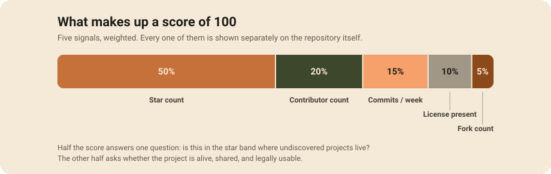
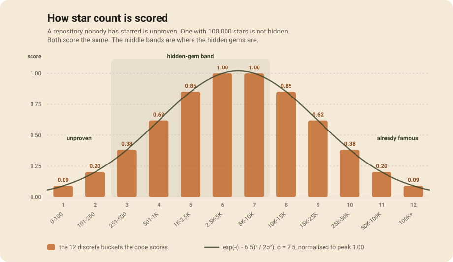

# GitCrawler

**A self-hosted GitHub "hidden gems" discovery platform.** GitCrawler crawls GitHub for repositories
that are relatively new, well-built, and gaining early traction — the projects that never make it
onto GitHub Trending because Trending only ever shows what's _already_ popular — scores them on
concrete signals (license, commit activity, contributors, forks, stars), and generates AI summaries
so you can judge relevance in seconds instead of reading every README yourself.



## Why

Existing discovery methods fall short: GitHub Trending favors what's already popular, search results
are noisy, and manually trawling GitHub to evaluate a repository's quality takes time nobody has.
GitCrawler is built around one principle — **optimize for signal over popularity**. If Trending shows
what's already successful, this platform tries to surface what's _about to become_ successful.

## Features

- **Hidden Gems scoring** — every repository gets a computed score from independently-weighted
  signals (star count, contributor count, commits/week, license presence/type, fork count), not
  stars alone. The full breakdown is visible per repository, not collapsed into a single opaque
  number. Star count is scored on a bell curve rather than "more is better": a repo nobody has
  found is unproven and one with 100k stars is not hidden, so both score the same and the middle
  bands win. See [How scoring works](#how-scoring-works).
- **AI summaries, two depths** — a short, glanceable summary on every card, and a longer detailed
  summary (purpose, features, tech stack, caveats) one click away — both generated locally via
  [LM Studio](https://lmstudio.ai/), no cloud AI vendor or per-call cost.
- **Per-repository trend growth** — each card shows how _that specific repository's_ own score has
  moved since its last re-crawl, not a blended average across every repo in its language.
- **Filter and sort** — by language, star range, topic, and license; sort by newest, score, stars, or
  commit activity.
- **Bookmarking** — save repositories to revisit later, with undo on every add/remove.
- **Click-through detail view** — full summary, topics, and score breakdown in a focused dialog.
- **Daily email digest** — a scheduled HTML email with the top-scored hidden gems and per-category
  trend summaries (with week-over-week growth), so you don't have to open the dashboard to catch
  what's new. Sent independently of the crawl pipeline via SMTP; a failed send is logged, never
  silently dropped.









## How it works

A background pipeline runs on a schedule, each stage handing off to the next via the same
PostgreSQL data store:

```
Crawl (GitHub API) → Score → Summarize (local LLM) → Aggregate trends
```

- **Crawler** — discovers new/updated repositories via the GitHub API (GraphQL-first, REST
  fallback), respecting rate limits.
- **Scoring Engine** — computes the hidden-gem score from the signals above, pure computation, no
  external calls.
- **Summarizer** — calls a local LM Studio model (Llama 3.2 3B Instruct) to generate both summary
  depths for top-scored repositories.
- **Trend Aggregator** — rolls up scored/summarized repositories into per-language trend data (used
  for the Language filter's option list) alongside each repository's own trend shown on its card.
- **Digest Service** — composes and sends the daily digest email on its own independent schedule
  (not chained onto the crawl pipeline, so it doesn't fire on every re-crawl), pulling from the
  same top-scored repositories and trend data the dashboard shows.

Everything is served from one ASP.NET Core process — the Web API and the built Angular dashboard —
backed by PostgreSQL, with LM Studio running alongside as a local inference engine. See
[`docs/architecture.md`](docs/architecture.md) for the full component breakdown and the 18 ADRs
behind these decisions.

## How scoring works

**The score is not a verdict on the repository. It is a measure of how likely you are to have
missed it.**

That distinction is the whole product. Every repository here is somebody's hard work, and this
platform is in no position to rank one person's craft above another's. What it can do is answer a
narrower, more honest question: _of the projects that look genuinely healthy, which ones has the
GitHub firehose never put in front of you?_ A high score means "you probably have not seen this and
you probably should." A low score means "this is not what you came here for" — never "this is bad
code."

Read one number and you learn nothing about a project. That is why the score is never shown alone:
open any repository and the five signals that produced it are broken out individually, so you can
disagree with the weighting and judge the raw evidence yourself.

### The five signals

| Signal            | Weight | Shape                                            | What it is evidence of                       |
| ----------------- | -----: | ------------------------------------------------ | -------------------------------------------- |
| Star count        |    50% | Bell curve over 12 buckets — peaks in the middle | Discovered enough to be real, not yet famous |
| Contributor count |    20% | Log curve, saturating at 25                      | More than one person's weekend               |
| Commits per week  |    15% | Log curve, saturating at 10                      | Someone is still working on it               |
| License present   |    10% | Binary                                           | You are actually allowed to use it           |
| Fork count        |     5% | Log curve, saturating at 200                     | Other people found it worth building on      |



Four of the five are ordinary "more is better" signals, log-normalized so a handful of enormous
repositories cannot drown out everyone else — going from 0 to 5 commits/week earns most of that
signal, going from 45 to 50 earns almost none. Saturation is deliberate: past a certain point,
_more_ stops being _better_, it is just _bigger_.

### Star count is not one of them



Every other discovery tool treats stars as a ladder — more is better, all the way up. Run that logic
to its conclusion and the perfect repository is the single most-starred project on GitHub. Which is
a result you did not need a crawler to find.

So stars fall into 12 buckets scored on a symmetric bell curve. Bucket 1 (0–100 stars) and bucket
12 (100,001+) score identically. So do 2 and 11, 3 and 10, and so on. Both tails are the same kind
of unhelpful for opposite reasons:

- **The left tail is unproven.** Nobody has vouched for it yet. That is not a criticism — everything
  starts there — but "nobody has looked at this" is not the same claim as "nobody has _found_ this,"
  and the platform cannot tell those apart from star count alone.
- **The right tail is already famous.** React is excellent. React is also not a hidden gem, and
  surfacing it tells you nothing you did not already know.

The hidden-gem band is buckets 3 through 7 — roughly 250 to 10,000 stars. That is where a project
has been validated by real users but has not yet been swept up by the algorithms, the newsletters,
and the conference talks. It sits slightly left of the curve's peak on purpose: a 400-star project
is more likely to be genuinely undiscovered than an 8,000-star one, even though the curve scores
the latter higher on star count alone.

The consequence worth stating plainly: **a famous repository scoring low here is not being
criticised.** Linux scores 0.09 on the star signal. That number means "you already know about
Linux," and nothing else.

The curve is a Gaussian centred between buckets 6 and 7 with σ = 2.5, normalised so the peak is
exactly 1.0 and the component stays in `[0,1]` like every other signal. σ is the one tunable knob —
it sets how sharply the score falls away from the middle, and at 2.5 the edge buckets keep about 9%
rather than being zeroed, so a well-maintained 50-star project can still out-score a dormant one in
the same bucket. The constants live in
[`ScoringWeights.cs`](src/backend/GitCrawler.Api/Features/Scoring/ComputeScores/ScoringWeights.cs),
the shape is pinned by tests, and the full rationale plus the rejected alternatives are in
[ADR-019](docs/adr/ADR-019-star-count-bell-curve-scoring.md).

### Two details that matter

**Commits per week is derived, not fetched.** GitHub gives a total commit count, which is divided by
the repository's age in weeks, floored at one week so a two-day-old repo with 50 commits does not
read as 175/week.

**A contributor list too large to enumerate scores full marks, not zero.** GitHub refuses to list
contributors past a certain size. Treating that refusal as "zero contributors" would dock 20% from
exactly the projects with the healthiest communities, so it is scored as the top of the bucket
instead.

### What this score is not for

Ranking accomplished, well-known projects against each other is a different question with different
signals, and this algorithm would answer it badly on purpose. A separate scoring mechanism for that
is a candidate for a future tranche; nothing here attempts it today.

## Staying inside GitHub's rate limits

The GitHub API is the one dependency this project cannot throttle its way around, and it enforces
three separate limits. The crawler handles each one distinctly rather than treating every 403 the
same — the budget analysis behind this is in
[`docs/spikes/f-001-github-graphql-rate-limit-budget.md`](docs/spikes/f-001-github-graphql-rate-limit-budget.md)
and the retry design in [ADR-018](docs/adr/).

**The three limits, and how each is detected:**

| Limit                       | GitHub's rule                                                | Signal on the wire                               | Response                            |
| --------------------------- | ------------------------------------------------------------ | ------------------------------------------------ | ----------------------------------- |
| GraphQL primary             | 5,000 points/hour (a query's cost, not its count)            | `RATE_LIMITED` error → query `rateLimit.resetAt` | Wait until the reset GitHub reports |
| REST primary                | 5,000 requests/hour, a separate pool                         | `x-ratelimit-remaining: 0` + `x-ratelimit-reset` | Wait until the reset GitHub reports |
| Secondary (abuse detection) | 100 concurrent, 900 pts/min per endpoint, 90s CPU per minute | 403/429 carrying `Retry-After`                   | Wait exactly that long              |

Nothing here guesses. Each wait comes from the timestamp GitHub itself returned, and the three
cases are distinct exception types so the retry policy can treat them differently instead of
blanket-retrying every failure.

**What the implementation does about it:**

- **GraphQL first, REST only where it has to.** Discovery is one GraphQL query per page of 50
  repositories, pulling license, forks, stars, topics, and commit count together — including the
  cheap `history(first:1).totalCount` trick for commit counts. Fetching the same data over REST
  would be dozens of calls per page. REST is used for exactly one thing: contributor counts, which
  GraphQL has no field for.
- **Contributor counts are cached for 7 days.** The spike found that a naive one-REST-call-per-repo
  design sits exactly at the REST ceiling at 5,000 repos/day, with zero headroom for a single
  retry. The freshness window turns a per-crawl cost into a weekly one.
- **Contributor counts are read from a header, not a payload.** `per_page=1` plus the `Link`
  header's `last` page number gives the total without downloading a single contributor.
- **Every rate-limit wait is honoured, not backed off blindly.** A Polly pipeline
  ([ADR-018](docs/adr/)) retries rate-limit failures indefinitely — correct, because they always
  resolve at a known time — with a 30-second floor so a stale or past reset timestamp can never
  turn into a tight retry loop. Everything else transient gets a small, capped retry instead.
- **Permanent failures are not retried at all.** GitHub returns a plain 403 with no distinguishing
  header when a repository has too many contributors to enumerate. That is permanent for that
  repository, so it is its own exception type that bypasses the retry pathway entirely, gets
  recorded, and does not burn the budget again for another 7 days.
- **Actual cost is logged every page.** `cost`, `remaining`, `limit`, and `resetAt` come back with
  every discovery query and go straight into the logs, so the real budget is measured rather than
  assumed.

**Known gap:** the summarizer fetches READMEs over REST without going through this pipeline, so a
rate-limit response there fails each repository in the batch individually instead of backing the
batch out cleanly. Tracked as M-3 in [`docs/code-review.md`](docs/code-review.md). There is also no
proactive pause when the remaining budget runs low — the crawler reacts once a limit is hit rather
than stopping short of it, which the spike recommends as a later hardening step.

## Tech stack

| Layer         | Technology                                                                                                    |
| ------------- | ------------------------------------------------------------------------------------------------------------- |
| Backend       | .NET 10, ASP.NET Core, [Wolverine](https://wolverine.netlify.app/) (vertical slice + CQRS), EF Core, Hangfire |
| Frontend      | Angular 22 (standalone components, signals), Angular Material                                                 |
| Data store    | PostgreSQL 18                                                                                                 |
| AI inference  | LM Studio, running locally (Llama 3.2 3B Instruct)                                                            |
| Orchestration | Docker Compose (app + Postgres) + a `Makefile` that also drives the host-installed LM Studio                  |

## Getting started

**Prerequisites:** Docker Desktop, [LM Studio](https://lmstudio.ai/download) (with its `lms` CLI
enabled) installed on the host, and `make`. Full one-time setup — generating a GitHub token,
configuring `.env`, downloading the model — is in [`docs/setup.md`](docs/setup.md).

```bash
cp .env.example .env   # then fill in POSTGRES_PASSWORD and GITHUB_TOKEN
make up
```

`make up` checks Docker's running, brings up the app + Postgres containers, checks/starts LM
Studio's local server, and loads the configured model — the dashboard is then at
`http://localhost:8080/`.

```bash
make status   # what's currently running
make health   # probe every component's actual endpoint
make down     # stop docker compose (LM Studio on the host is left running)
make help     # full target list
```

### Active development

`make up` rebuilds the whole app image on every change — fine for a demo, slow for iterating.
`make dev` instead runs only Postgres in Docker and prints the commands to run the backend
(`dotnet watch run`) and frontend (`npm start`) bare, so both hot-reload on save. See
[`docs/setup.md` §3a](docs/setup.md#3a-faster-inner-loop-for-active-development) for details.

### Build & test

```bash
# backend (src/backend/)
dotnet build
dotnet test
dotnet format

# frontend (src/frontend/)
npm run build
npm run test -- --watch=false
npm run lint
```

## Project status

Solo-operator project, actively developed. **Tranche v1 (the MVP) is closed** — all six phases
shipped, F-001 through F-018: scaffolding, data pipeline, AI summarization and trends, dashboard +
API + bookmarking, daily email digest + observability, and security/reliability/scalability
hardening (secret scanning, job idempotency guards, dashboard indexes with server-side
sort/pagination). The v1 backlog and handoff are archived under
[`docs/archive/v1-mvp/`](docs/archive/v1-mvp/).

**Tranche v2 is open with an empty backlog** — its phases and feature IDs get assigned during
triage, so there is no in-flight work right now. See
[`docs/project-management.md`](docs/project-management.md) for the backlog,
[`docs/handoff.md`](docs/handoff.md) for the running change log, and
[`CONTRIBUTING.md`](CONTRIBUTING.md) for how new work enters.

## Documentation

| Doc                                                                                         | What's in it                                                             |
| ------------------------------------------------------------------------------------------- | ------------------------------------------------------------------------ |
| [`docs/prd.md`](docs/prd.md)                                                                | Product requirements — problem statement, goals, non-goals, user stories |
| [`docs/architecture.md`](docs/architecture.md)                                              | System design, component breakdown, technology decisions                 |
| [`docs/adr/`](docs/adr)                                                                     | Architecture Decision Records behind the technology/design choices       |
| [`docs/project-management.md`](docs/project-management.md)                                  | Phases, feature backlog, acceptance criteria                             |
| [`docs/setup.md`](docs/setup.md)                                                            | Full local setup walkthrough                                             |
| [`docs/handoff.md`](docs/handoff.md)                                                        | Running log of recent changes and their rationale                        |
| [`docs/test-runbook.md`](docs/test-runbook.md) / [`docs/test-cases.md`](docs/test-cases.md) | Test strategy and case inventory                                         |
| [`CONTRIBUTING.md`](CONTRIBUTING.md)                                                        | Dev loop, quality gate, the constraints that are non-negotiable          |

## License

[MIT](LICENSE)
