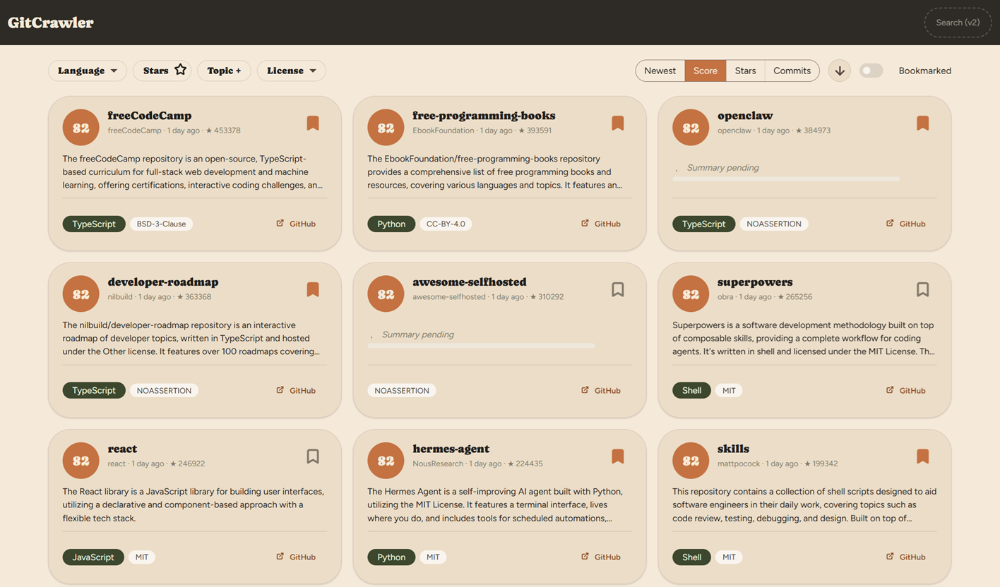
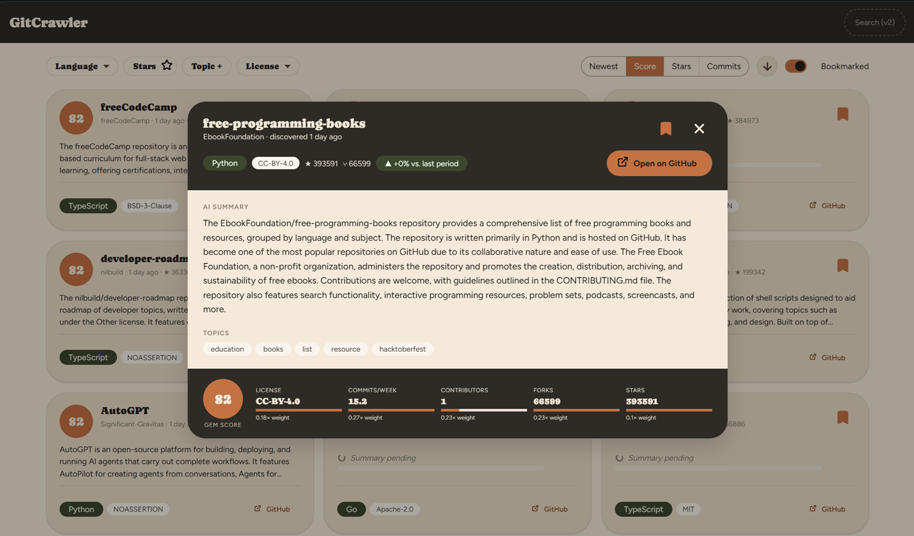
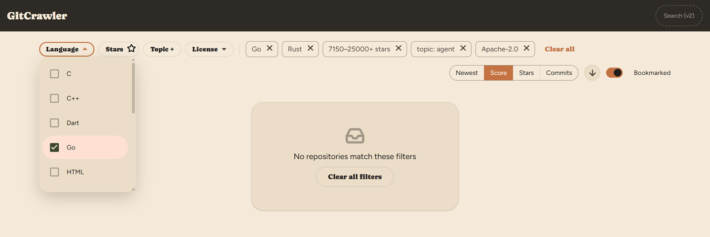
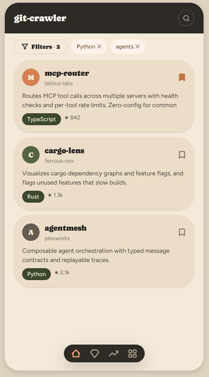

# GitCrawler

**A self-hosted GitHub "hidden gems" discovery platform.** GitCrawler crawls GitHub for repositories
that are relatively new, well-built, and gaining early traction — the projects that never make it
onto GitHub Trending because Trending only ever shows what's *already* popular — scores them on
concrete signals (license, commit activity, contributors, forks, stars), and generates AI summaries
so you can judge relevance in seconds instead of reading every README yourself.



## Why

Existing discovery methods fall short: GitHub Trending favors what's already popular, search results
are noisy, and manually trawling GitHub to evaluate a repository's quality takes time nobody has.
GitCrawler is built around one principle — **optimize for signal over popularity**. If Trending shows
what's already successful, this platform tries to surface what's *about to become* successful.

## Features

- **Hidden Gems scoring** — every repository gets a computed score from independently-weighted
  signals (license presence/type, commits/week, contributor count, fork count, star count), not
  stars alone. The full breakdown is visible per repository, not collapsed into a single opaque
  number.
- **AI summaries, two depths** — a short, glanceable summary on every card, and a longer detailed
  summary (purpose, features, tech stack, caveats) one click away — both generated locally via
  [LM Studio](https://lmstudio.ai/), no cloud AI vendor or per-call cost.
- **Per-repository trend growth** — each card shows how *that specific repository's* own score has
  moved since its last re-crawl, not a blended average across every repo in its language.
- **Filter and sort** — by language, star range, topic, and license; sort by newest, score, stars, or
  commit activity.
- **Bookmarking** — save repositories to revisit later, with undo on every add/remove.
- **Click-through detail view** — full summary, topics, and score breakdown in a focused dialog.







## How it works

A background pipeline runs on a schedule, each stage handing off to the next via the same
PostgreSQL data store:

```
Crawl (GitHub API) → Score → Summarize (local LLM) → Aggregate trends
```

- **Crawler** — discovers new/updated repositories via the GitHub API (GraphQL-first, REST
  fallback), respecting rate limits.
- **Scoring Engine** — computes the hidden-gem score from the signals above, pure computation, no
  external calls.
- **Summarizer** — calls a local LM Studio model (Llama 3.2 3B Instruct) to generate both summary
  depths for top-scored repositories.
- **Trend Aggregator** — rolls up scored/summarized repositories into per-language trend data (used
  for the Language filter's option list) alongside each repository's own trend shown on its card.

Everything is served from one ASP.NET Core process — the Web API and the built Angular dashboard —
backed by PostgreSQL, with LM Studio running alongside as a local inference engine. See
[`docs/architecture.md`](docs/architecture.md) for the full component breakdown and the 18 ADRs
behind these decisions.

## Tech stack

| Layer | Technology |
|---|---|
| Backend | .NET 10, ASP.NET Core, [Wolverine](https://wolverine.netlify.app/) (vertical slice + CQRS), EF Core, Hangfire |
| Frontend | Angular 22 (standalone components, signals), Angular Material |
| Data store | PostgreSQL 18 |
| AI inference | LM Studio, running locally (Llama 3.2 3B Instruct) |
| Orchestration | Docker Compose (app + Postgres) + a `Makefile` that also drives the host-installed LM Studio |

## Getting started

**Prerequisites:** Docker Desktop, [LM Studio](https://lmstudio.ai/download) (with its `lms` CLI
enabled) installed on the host, and `make`. Full one-time setup — generating a GitHub token,
configuring `.env`, downloading the model — is in [`docs/setup.md`](docs/setup.md).

```bash
cp .env.example .env   # then fill in POSTGRES_PASSWORD and GITHUB_TOKEN
make up
```

`make up` checks Docker's running, brings up the app + Postgres containers, checks/starts LM
Studio's local server, and loads the configured model — the dashboard is then at
`http://localhost:8080/`.

```bash
make status   # what's currently running
make health   # probe every component's actual endpoint
make down     # stop docker compose (LM Studio on the host is left running)
make help     # full target list
```

### Active development

`make up` rebuilds the whole app image on every change — fine for a demo, slow for iterating.
`make dev` instead runs only Postgres in Docker and prints the commands to run the backend
(`dotnet watch run`) and frontend (`npm start`) bare, so both hot-reload on save. See
[`docs/setup.md` §3a](docs/setup.md#3a-faster-inner-loop-for-active-development) for details.

### Build & test

```bash
# backend (src/backend/)
dotnet build
dotnet test
dotnet format

# frontend (src/frontend/)
npm run build
npm run test -- --watch=false
npm run lint
```

## Project status

Solo-operator project, actively developed. Phases 0–3 (scaffolding, data pipeline, AI
summarization/trends, dashboard + API + bookmarking) are done; the daily email digest,
observability, and hardening phases are planned next. See
[`docs/project-management.md`](docs/project-management.md) for the full feature backlog and
[`docs/handoff.md`](docs/handoff.md) for a running log of what's changed most recently.

## Documentation

| Doc | What's in it |
|---|---|
| [`docs/prd.md`](docs/prd.md) | Product requirements — problem statement, goals, non-goals, user stories |
| [`docs/architecture.md`](docs/architecture.md) | System design, component breakdown, technology decisions |
| [`docs/adr/`](docs/adr) | Architecture Decision Records behind the technology/design choices |
| [`docs/project-management.md`](docs/project-management.md) | Phases, feature backlog, acceptance criteria |
| [`docs/setup.md`](docs/setup.md) | Full local setup walkthrough |
| [`docs/handoff.md`](docs/handoff.md) | Running log of recent changes and their rationale |
| [`docs/test-runbook.md`](docs/test-runbook.md) / [`docs/test-cases.md`](docs/test-cases.md) | Test strategy and case inventory |

## License

[MIT](LICENSE)
