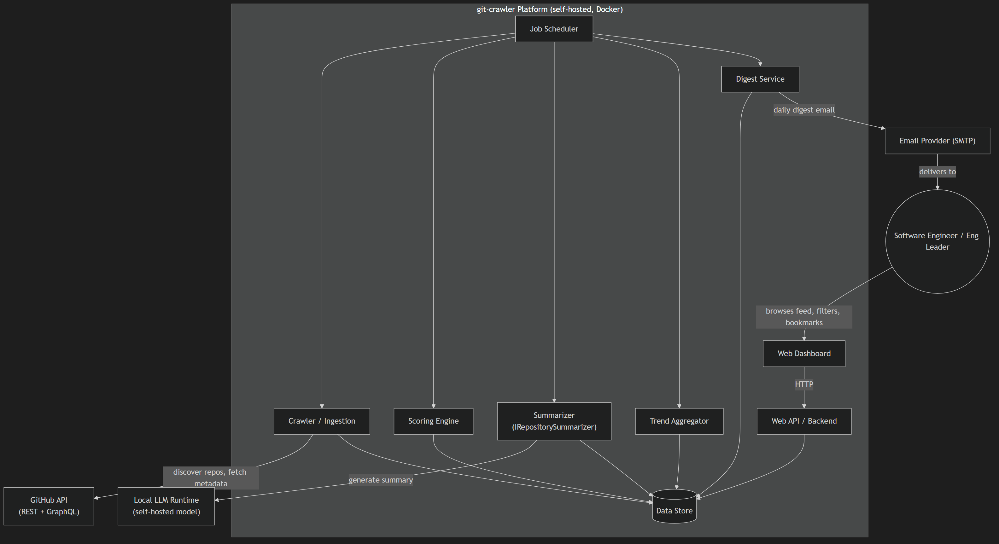
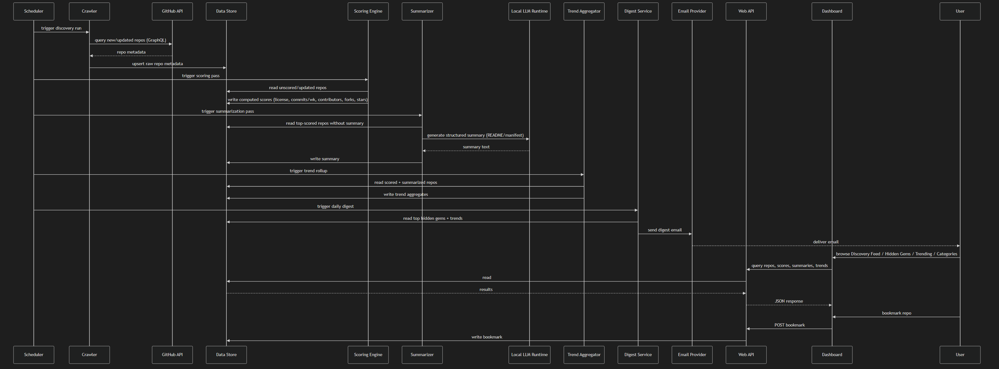

# Architecture: GitHub Hidden Gems Discovery Platform

> Status: APPROVED
> Version: v18
> Last updated: 2026-08-03
> PRD: docs/prd.md (built against v6)

## 1. System Context

The platform is a self-hosted (Docker Compose) system operated by a single engineer. It has three
external dependencies:

- **GitHub API** (GraphQL primary, REST fallback) — the sole source of repository discovery and
  metadata; no bulk repository cloning in v1.
- **Local LLM runtime** (LM Studio) — runs host-installed on the same machine (not containerized,
  ADR-016) and serves AI-generated repository summaries; no external AI vendor credential exists
  in v1 (ADR-001, ADR-007, ADR-016).
- **Email provider (SMTP)** — outbound channel for the daily digest; no inbound integration.

A single user type interacts with the system directly: the software engineer / engineering leader
browsing the dashboard and receiving the digest. There is no team, organization, or multi-tenant
concept in v1 (per PRD Non-Goals).

## 2. High-Level Architecture

The platform is a modular .NET 10 monolith (ADR-010) — one deployable process hosting the Web API
and serving the Angular dashboard's static build (ADR-008), plus background components for
crawling, scoring, summarization, and trend aggregation — all orchestrated by an in-process job
scheduler (ADR-009). It is packaged as two Docker Compose services — the app container and
PostgreSQL (ADR-003) — plus a host-installed local LLM runtime (ADR-001) that Compose does not
manage; a `Makefile` orchestrates bringing both up together (ADR-016). This is a modular monolith
rather than microservices deliberately: a solo operator (per PRD constraints) benefits from one
deployable unit and one codebase far more than from independently-scalable services, and nothing
in the PRD's volume targets (1K-5K/day, scaling to 100k+) requires service-level horizontal
scaling yet (see ADR-002 consequences for the revisit trigger). The dashboard is a separate
Angular codebase from the .NET backend (ADR-008) but is still built into and served from the same
deployable process, so this split doesn't add a second runtime container.

Internally, every backend component — the Web API and each of the five background pipeline stages
— is organized as Vertical Slice Architecture, with a Wolverine command/query and its handler as
the unit of a slice, instead of a shared service/repository layer (ADR-015). Hangfire (ADR-009)
invokes a Wolverine command per pipeline stage rather than calling a service method directly.

Each pipeline stage (crawl → score → summarize → aggregate trends → send digest) is a distinct
component with a narrow responsibility, triggered on its own schedule but sharing the same
PostgreSQL data store as its integration point — components don't call each other directly, they
read/write shared state, which keeps each stage independently testable and restart-safe.

## 3. Components

### Crawler / Ingestion
- **Responsibility:** Discover new/updated repositories from GitHub matching baseline discovery
  criteria (age, activity, exclusions) and fetch the metadata fields the Scoring Engine needs.
- **Inputs:** Scheduler trigger; GitHub API responses.
- **Outputs:** Raw repository metadata records written to the Data Store.
- **Dependencies:** GitHub API (GraphQL-first, REST fallback — ADR-004); GitHub API token.
- **Technology:** .NET background service, GitHub GraphQL/REST clients; implemented as a Wolverine
  command/handler slice (ADR-015).

### Scoring Engine
- **Responsibility:** Compute the "hidden gem" score per repository from independently-weighted
  signals: license presence/type, commits-per-week activity, contributor count, fork count, and
  existing popularity/quality signals (per PRD Constraints).
- **Inputs:** Raw repository metadata from the Data Store.
- **Outputs:** Computed score + per-signal breakdown, written to the Data Store.
- **Dependencies:** Data Store.
- **Technology:** .NET library, pure computation (no external calls) — keeps scoring
  deterministic and independently unit-testable; implemented as a Wolverine command/handler slice
  (ADR-015).

### Summarizer
- **Responsibility:** Generate two distinct AI summaries for repositories that clear the scoring
  threshold, from README/manifest content (operator direction: "there should be two kinds of
  summaries: short that show on the repo card and then the detailed one"). Both are plain-text (no
  Markdown headings/bullet points/section labels), generated via two separate LM Studio calls per
  repo rather than one call producing both: a short one (`Summarization:MaxSummaryLength`
  characters, default 220 — sized to fit the dashboard card's 3-line clamp without server-side
  truncation) and a detailed one (`Summarization:MaxDetailedSummaryLength`, default 900, 2-4 short
  paragraphs — shown in full in the click-through detail dialog, which has no line clamp). Both
  length constraints are enforced by asking the model for them, not by trimming the response
  afterward. The two-call choice trades doubled LM Studio inference time per repo (operator-
  confirmed) for each prompt being tuned to its own length/purpose, rather than risking a single
  call's structured response not parsing cleanly. README content is capped at
  `Summarization:MaxReadmeCharacters` (default 6000) before either prompt is built — found via a
  live failure where an uncapped 111KB README exceeded the loaded model's context window outright
  (LM Studio rejected the request rather than truncating server-side).
- **Inputs:** Repository content (README, manifest files) for top-scored repos without a summary.
- **Outputs:** Two plain-text summaries (short + detailed) written to the Data Store.
- **Dependencies:** Local LLM Runtime, via the `IRepositorySummarizer` abstraction (ADR-001).
- **Technology:** .NET service calling LM Studio's local (OpenAI-compatible) API (ADR-007),
  running the Llama 3.2 3B Instruct model (ADR-017, supersedes ADR-013); implemented as a
  Wolverine command/handler slice (ADR-015).

### Trend Aggregator
- **Responsibility:** Roll up scored/summarized repositories into technology/framework/ecosystem
  trend summaries (Goal 3).
- **Inputs:** Scored + summarized repositories from the Data Store.
- **Outputs:** Trend aggregate records written to the Data Store.
- **Dependencies:** Data Store.
- **Technology:** .NET background service, scheduled batch job; implemented as a Wolverine
  command/handler slice (ADR-015).

### Digest Service
- **Responsibility:** Compose and send the daily email digest of top hidden gems and trends.
- **Inputs:** Top-scored repos + trend aggregates from the Data Store.
- **Outputs:** Outbound digest email.
- **Dependencies:** Data Store; Email Provider (SMTP).
- **Technology:** .NET background service, SMTP client; implemented as a Wolverine
  command/handler slice (ADR-015).

### Web API
- **Responsibility:** Serve the Dashboard's queries (hidden gems — including each card's trend
  growth, computed from TrendAggregate — categories, filter/sort) and handle bookmark writes, as a
  self-contained JSON API with no server-rendered view dependencies. (Dedicated `/api/trending`,
  `/api/discovery-feed`, and `/api/bookmarks` GET endpoints existed through 2026-08-03; all three
  removed the same day their dashboard views were decommissioned — `/api/trending` and
  `/api/bookmarks`'s list endpoint since nothing else consumed them, `/api/discovery-feed` since
  Hidden Gems offered no meaningfully distinct browsing experience once Categories and Trending had
  already folded into it. Bookmark create/delete endpoints stay mapped — the bookmark toggle on every
  card still needs them.)
- **Inputs:** HTTP requests from the Dashboard.
- **Outputs:** JSON responses; bookmark writes to the Data Store.
- **Dependencies:** Data Store.
- **Technology:** ASP.NET Core minimal API; also serves the Angular build's static assets from the
  same process (ADR-008); endpoints organized as Wolverine command/query slices, one per operation
  (ADR-015).

### Web Dashboard
- **Responsibility:** Present the Hidden Gems view (the dashboard's sole view); filter/sort by
  language, star range, topic, license; bookmark management. (The standalone Categories view and its
  drill-down were removed 2026-08-03 — Repository.PrimaryLanguage, the value Category is defined as,
  remains fully filterable via the existing Language facet on Hidden Gems, so no browsing capability
  was lost. The standalone Trending view was likewise removed the same day and merged into Hidden
  Gems — each card shows its own trend growth directly, so a separate view is no longer needed to
  see the same information. Initially computed server-side from TrendAggregate (the repo's
  language/category's rollup, shared by every repo of that language); changed 2026-08-04 to be
  computed per repository instead, from that repo's own Score history — operator: "Trend is
  currently calculated per language. I want it to be calculated per repository." TrendAggregate
  itself is unchanged and still backs the Language filter's option list (Categories query). The standalone
  Discovery Feed view was removed the same way too, later the same day — once Categories and Trending
  had already folded into Hidden Gems, Discovery Feed no longer offered a meaningfully distinct
  browsing experience over it. F-012's dedicated Bookmarks view was removed last, the same way again —
  Hidden Gems' existing "Bookmarked only" filter already surfaces the same repos, so revisiting a
  bookmarked repo (FR-007) is done from Hidden Gems now, not a separate view. Clicking a card also
  opens a right-side detail pane — full summary, topics, and score breakdown — fulfilling the
  dashboard UX design brief's own §09 mockup, which F-011's original
  implementation had not yet built.)
- **Inputs:** User interaction; JSON data from the Web API.
- **Outputs:** Rendered UI; bookmark/filter HTTP requests to the Web API.
- **Dependencies:** Web API (same-origin HTTP, static files served from the same process).
- **Technology:** Angular 22 SPA (ADR-008, ADR-012), standalone components, UI built with Angular
  Material (ADR-011).

### Job Scheduler
- **Responsibility:** Trigger each pipeline stage on its schedule, in dependency order (crawl
  before score, score before summarize, summarize before trend rollup, trend rollup before
  digest), recover in-flight/misfired jobs after a restart, and expose run history/failures for
  operator monitoring. The Summarizer additionally has its own standalone, more-frequent recurring
  trigger (hourly by default, `Hangfire:SummarizationCronSchedule`) alongside its chain
  attachment — the chain alone only gives it one chance to run per daily crawl cycle, which left a
  backlog of scored-but-not-yet-summarized repos (larger than one `Summarization:BatchSize` batch)
  sitting unsummarized for days; both triggers converge on the same "no Summary row yet" selection,
  so the extra trigger is a no-op once the backlog clears.
- **Inputs:** Configured recurring schedules and stage-continuation chain.
- **Outputs:** Triggers to Crawler, Scoring Engine, Summarizer, Trend Aggregator, Digest Service;
  dashboard view of job state.
- **Dependencies:** Data Store (persistent job storage).
- **Technology:** Hangfire (`RecurringJob` + `ContinueJobWith`) with PostgreSQL-backed storage and
  its built-in monitoring dashboard (ADR-009); each trigger invokes a Wolverine command on the
  target stage (ADR-015).

### Data Store
- **Responsibility:** Durable storage for repository metadata, scores, summaries, trend
  aggregates, bookmarks, and Hangfire job state.
- **Inputs:** Writes from every other component.
- **Outputs:** Reads for every other component.
- **Dependencies:** None (leaf component).
- **Technology:** PostgreSQL 18.4, accessed via EF Core (ADR-003, ADR-014).

## 4. Data Flow

The primary use case is the daily discovery run, from scheduled crawl through to a user browsing
the dashboard and receiving the digest.

## 5. Functional Requirements

| ID | Requirement | Source (PRD story) | Priority |
|----|-------------|-------------------|----------|
| FR-001 | Discover new/updated repositories via the GitHub API on a recurring schedule | US-1 | Must |
| FR-002 | Compute a hidden-gem score per repository from weighted signals | US-1, US-4 | Must |
| FR-003 | Generate a structured AI summary per top-scored repository | US-2 | Must |
| FR-004 | Filter and sort repositories by language, star range, topic, and license | US-3 | Must |
| FR-005 | Expose license, commits-per-week, contributor count, and fork count as identifiable, independently-weighted scoring inputs | US-4 | Must |
| FR-006 | Compose and send a daily email digest of top hidden gems and trends | US-5 | Should |
| FR-007 | Allow a user to save/bookmark a repository and revisit it later | US-6 | Must |
| FR-008 | Aggregate discoveries into technology/framework/ecosystem trend summaries | US-7 | Must |
| FR-009 | Present Hidden Gems as the dashboard's repository-browsing view | US-8 | Must |

## 6. Non-Functional Requirements

| ID | Category | Requirement | Notes |
|----|----------|-------------|-------|
| NFR-001 | Performance | Summary generation completes on the order of seconds per repository; dashboard interactions feel interactive (target p95 page response < 2s) | Formalizes PRD's "Responsiveness assumption"; local LLM throughput (ADR-001) is the primary risk to this — see A2 |
| NFR-002 | Security | GitHub API token stored via environment/secrets configuration, never committed or logged; no AI provider credential exists in v1 since summarization is local (ADR-001) | Formalizes PRD's Security assumption |
| NFR-003 | Reliability | Every pipeline stage is idempotent and resumable after a container restart mid-run; GitHub API failures retry with backoff rather than aborting the run | Enabled by Hangfire's persistent job storage (ADR-009) |
| NFR-004 | Scalability | Schema and indexing support 100k+ repositories and 1M+ analysis records without a redesign | Formalizes PRD's processing volume assumption; partitioning/archiving strategy is an open risk — see A5 |
| NFR-005 | Observability | Each pipeline stage emits structured logs and stage-level metrics (records processed, duration, failures) so a solo operator can diagnose a stuck or rate-limited run without attaching a debugger | Not sourced from an explicit PRD line item; job-level piece (history, retries, failures) now covered by the Hangfire dashboard (ADR-009) — F-014 still needed for stage-level detail (e.g. per-signal scoring breakdowns) the dashboard doesn't capture |

## 7. Technology Decisions

| Concern | Choice | ADR | Rationale |
|---------|--------|-----|-----------|
| AI summarization backend | Local/self-hosted LLM via `IRepositorySummarizer` | ADR-001 | Avoids per-call cost at target volume; keeps repository content on self-hosted infra |
| Local LLM runtime engine | LM Studio | ADR-007 | Operator preference; OpenAI-compatible local API keeps the `IRepositorySummarizer` integration small |
| Local LLM runtime deployment | Host-installed, not containerized; reached via `host.docker.internal` | ADR-016 | Operator already runs LM Studio natively; a container would duplicate it, lose GPU/Metal acceleration, and depend on an unstable preview image |
| Summarization model | Llama 3.2 3B Instruct (loaded in LM Studio) | ADR-017 (supersedes ADR-013) | F-002's live benchmark found the original pin (Gemma 4 E4B) truncated output on reasoning-token overhead despite passing throughput; this model was chosen from a live comparison against 4 alternatives — fastest, zero reasoning waste, complete output |
| Deployment / hosting | Docker Compose (app + PostgreSQL), self-hosted/on-prem; `Makefile` bridges to the host-installed LLM runtime | ADR-002, ADR-016 | Matches solo, no-fixed-deadline project profile; single-entrypoint `make up` keeps the "everything comes up together" operator experience despite the split topology |
| Primary data store | PostgreSQL via EF Core | ADR-003 | Relational access pattern fits filter/sort/join-heavy queries; no license cost |
| Data store version | PostgreSQL 18.4 (pinned image tag) | ADR-014 | Operator preference; pinned tag avoids silent upgrade drift |
| GitHub API access strategy | GraphQL-first, REST fallback | ADR-004 | Minimizes rate-limit consumption per repository at 1K-5K/day scaling to 100k+ |
| Web dashboard framework | Angular SPA, served as static assets from the Web API process | ADR-008 | Matches operator's standing frontend preference; keeps single-deployable-process footprint (ADR-002) |
| Frontend framework version | Angular 22, standalone components | ADR-012 | Operator preference; pinned explicitly rather than resolved at scaffolding |
| Dashboard UI component library | Angular Material (`@angular/material` + `@angular/cdk`) | ADR-011 | Free, MIT-licensed, maintained by the Angular team; no built-vs-buy tradeoff for a solo developer |
| Job scheduling / orchestration | Hangfire, persistent job storage + built-in dashboard | ADR-009 | Survives restarts mid-pipeline; built-in dashboard directly serves NFR-005 for a solo operator |
| Runtime / SDK version | .NET 10 | ADR-010 | Operator preference; single version across all backend components |
| Internal code organization | Vertical Slice Architecture + CQRS via Wolverine, applied to the Web API and all five background pipeline stages | ADR-015 | Operator preference; explicitly not MediatR (which is moving toward commercial licensing) — Wolverine stays fully open-source |
| Crawler retry/resilience | Polly (`ResiliencePipeline`, chained retry strategies) | ADR-018 | Already present transitively; declaring it directly and expressing GitHub's rate-limit vs. generic-transient vs. permanent-failure pathways as distinct chained strategies replaced a hand-rolled loop that had no way to express "don't retry this" |

## 8. Open Questions & Risks

| ID | Question / Risk | Impact | Owner | Resolved? |
|----|----------------|--------|-------|-----------|
| A1 | GitHub GraphQL rate-limit budget (point-cost model) has not been validated against the 1K-5K/day discovery volume, or the 100k+ scale-out target | High | Maxx | No |
| A2 | ~~Local LLM inference throughput/model choice is unproven against the seconds-per-repo target in NFR-001~~ — **Resolved 2026-08-01**: `google/gemma-4-e4b` measured at 2.57-2.82s p95 per repo (Pass), but found to truncate output on reasoning-token overhead; superseded by `llama-3.2-3b-instruct` (ADR-017), measured at 0.78-1.05s mean per repo with complete output. See `docs/spikes/f-002-lm-studio-throughput-benchmark.md` §9-§10 | High | Maxx | **Yes** |
| A3 | (Carried from PRD Q2) Numeric success-metric targets remain `[TBD]` pending an initial usage baseline post-launch | Low | Maxx | No |
| A4 | (Carried from PRD Q3) Whether personalized discovery lands in an early post-MVP phase is still undecided — affects PMBook phase sequencing, not v1 architecture | Medium | Maxx | No |
| A5 | Docker Compose (ADR-002) caps horizontal scaling; no defined trigger yet for when 100k+ repos / 1M+ records would force revisiting single-node deployment | Medium | Maxx | No |

## Version History
| Version | Date | Change | Triggered By |
|---------|------|--------|---------------|
| v1 | 2026-07-28 | Initial draft | — |
| v2 | 2026-07-28 | Local LLM runtime engine pinned to LM Studio (was illustrative "e.g. Ollama" in ADR-001); added ADR-007 and a Technology Decisions row for the runtime engine | Triage edit |
| v3 | 2026-07-28 | Status → APPROVED | Gate approval |
| v4 | 2026-07-28 | Web dashboard framework changed from Blazor Server to Angular SPA (ADR-008 supersedes ADR-005); dashboard now a separate codebase built to static assets and served from the same process | Triage edit |
| v5 | 2026-07-28 | Job scheduling changed from Quartz.NET to Hangfire (ADR-009 supersedes ADR-006) for its built-in monitoring dashboard against NFR-005; Job Scheduler component, NFR-003/NFR-005 notes, and Technology Decisions table updated | Triage edit |
| v6 | 2026-07-28 | Pinned runtime/SDK version to .NET 10 (ADR-010, new — nothing previously specified a version); also fixed a stale ADR-006 citation in §2 that should have read ADR-009 after the v5 edit | Triage edit |
| v7 | 2026-07-28 | Added Angular Material as the dashboard UI component library (ADR-011, new, free/MIT); noted Angular's own version is latest-stable-pinned-at-scaffolding rather than a fixed number, pending operator confirmation | Triage edit |
| v8 | 2026-07-28 | Pinned frontend framework version to Angular 22 (ADR-012, new) — replaces the "latest stable, resolved at scaffolding" placeholder from v7 | Triage edit |
| v9 | 2026-07-28 | Pinned summarization model to Gemma 4 E4B (ADR-013, new) and data store version to PostgreSQL 18.4 (ADR-014, new); neither had a version pinned previously | Triage edit |
| v10 | 2026-07-28 | Adopted Vertical Slice Architecture + CQRS via Wolverine (ADR-015, new), applied to the Web API and all five background pipeline stages, not MediatR; §2, all §3 component Technology lines, and Technology Decisions table updated | Triage edit |
| v11 | 2026-08-01 | LM Studio changed from a Docker Compose container to a host-installed native app, reached via `host.docker.internal` and orchestrated alongside Compose by a new `Makefile` (ADR-016, new — amends ADR-002 and ADR-007's deployment-topology framing, doesn't change the engine choice); §1, §2, and Technology Decisions table updated | Operator correction post-F-003 (LM Studio already installed on the target machine) |
| v12 | 2026-08-02 | Crawler's GitHub retry/resilience pathways (rate-limit, generic-transient, and a new permanent-failure case) now expressed via Polly `ResiliencePipeline` instead of a hand-rolled loop (ADR-018, new); Technology Decisions table updated | Live-crawl verification surfaced a permanent GitHub 403 (`torvalds/linux` contributor count) the old catch-all retry loop misclassified as transient |
| v12 | 2026-08-01 | Risk A2 marked Resolved (§8) — live benchmark run against `google/gemma-4-e4b`, 2.57-2.82s p95 per repo vs. NFR-001's target, see `docs/spikes/f-002-lm-studio-throughput-benchmark.md` §9 | F-002 spike executed live |
| v13 | 2026-08-01 | Summarization model changed from Gemma 4 E4B to Llama 3.2 3B Instruct (ADR-017, new, supersedes ADR-013) — the original pin passed throughput but truncated output on reasoning-token overhead; §3 Summarizer, §7 Technology Decisions, and §8 risk A2 updated | Live model comparison, operator decision: "use llama-3.2-3b-instruct" |
| v14 | 2026-08-03 | Categories removed as a distinct dashboard view: §3 Web Dashboard responsibility and FR-009 now list Discovery Feed, Hidden Gems, and Trending only. Browsing by category is unaffected in substance — Category ≡ Repository.PrimaryLanguage (F-009/F-010), and that value remains fully filterable via the existing Language facet already shared by Discovery Feed/Hidden Gems — only the dedicated tab + drill-down route were decommissioned as redundant. Web API's `/api/categories` endpoint is unchanged (still backs the Language filter's option list) | Operator: "make category a filter and get rid of the category tab on UI and under the hood plumbing" |
| v15 | 2026-08-03 | Trending removed as a distinct dashboard view: §3 Web Dashboard responsibility and FR-009 now list Discovery Feed and Hidden Gems only. Unlike Categories (v14), this one did change the Web API surface — `/api/trending` is fully removed, not kept — since nothing besides the Trending view ever consumed it; each Hidden Gems card now carries its own category's trend growth computed server-side from the same TrendAggregate data | Operator: "merge trending, add the trending score to the repo card on the hidden gems and then remove the trending tab as well" |
| v16 | 2026-08-03 | Discovery Feed removed as a distinct dashboard view: §3 Web Dashboard responsibility and FR-009 now name Hidden Gems as the dashboard's sole repository-browsing view (Bookmarks remains a separate, dedicated view per F-012). Like Trending (v15), this changed the Web API surface — `/api/discovery-feed` is fully removed, since `GetHiddenGems` was already the full-featured superset of the shared D4 filter/sort/paginate contract once Categories/Trending had folded away, leaving no distinct capability for Discovery Feed to keep offering | Operator: "Discovery Feed: remove it. there isnt much difference between that and the hidden gems." |
| v17 | 2026-08-03 | §3 Web Dashboard responsibility noted a new click-to-open repository detail pane — fulfills the dashboard UX design brief's own §09 mockup (full summary, topics, score breakdown in a right-side drawer), which F-011's original implementation never built; no FR/NFR change, since no Functional Requirement committed to a detail pane in the first place — this is UX polish drawing on an already-approved design element, not new product scope | Operator: "adjust the ui of repo card... click to open details pane. see 09 in the Dashboard Design.dc.html" |
| v18 | 2026-08-03 | F-012's dedicated Bookmarks view removed: §3 Web Dashboard responsibility now names Hidden Gems as the dashboard's sole view; §3 Web API responsibility notes `/api/bookmarks`'s GET (list) endpoint is fully removed too, same as `/api/discovery-feed`/`/api/trending`, since nothing else consumed it — create/delete stay mapped for the bookmark toggle. FR-007 itself is unaffected (still satisfied, now via Hidden Gems' existing "Bookmarked only" filter instead of a dedicated view) | Operator: "i dont think we need the bookmarks tab either since its a filter on the hidden gems tab" |
| v19 | 2026-08-04 | Summarizer changed from a "concise, structured" (headed-sections) prompt to a plain-text, ~3-sentence prompt explicitly capped at `Summarization:MaxSummaryLength` characters (default 220, new config) — §3 Summarizer updated; the prior structured output's own heading/section text was eating into the dashboard card's fixed 3-line clamp and crowding out the actual summary content. §3 Job Scheduler updated: the Summarizer now also has its own standalone hourly recurring trigger (`Hangfire:SummarizationCronSchedule`, new config) in addition to its existing chain attachment, so a backlog of scored-but-unsummarized repos no longer waits for the next full daily crawl cycle to be picked up | Operator: "we need to check more frequently for the repos that dont have a summary... summary should be x characters long... adjust prompt and ask for 3 liner (x character summary) so we dont have to truncate" |
| v20 | 2026-08-04 | Summarizer now generates two distinct summaries per repo instead of one - §3 Summarizer rewritten: a short one (unchanged `Summarization:MaxSummaryLength`, still the card's summary) and a new detailed one (`Summarization:MaxDetailedSummaryLength`, default 900, new config), each via its own LM Studio call (two calls per repo, operator-confirmed over a single call with a parsed structured response). `Summary.Content` split into `Summary.ShortContent`/`Summary.DetailedContent` in the Data Store; the migration that added this deleted every pre-existing Summary row (operator-confirmed - Summary's create-once design means there's no backfill path for the new field otherwise) | Operator: "there should be two kinds of summaries: short that show on the repo card and then the detailed one" |
| v21 | 2026-08-04 | §3 Summarizer updated: README content sent to LM Studio is now capped at `Summarization:MaxReadmeCharacters` (default 6000, new config) before either prompt is built. Found via a live failure — an uncapped 111KB README (`openclaw/openclaw`) exceeded the loaded model's 8192-token context window outright, which LM Studio rejects as a hard error rather than truncating server-side, so any repo with a large enough README would have failed identically | Operator pasted a live LM Studio 400 error from a `make dev` session |
| v22 | 2026-08-04 | §3 Web Dashboard updated: each Hidden Gems card's trend growth is now computed per repository (from that repo's own Score history across re-crawls) instead of per language/category (from its shared TrendAggregate rollup) — every repo of a given language no longer shows the same growth figure. TrendAggregate itself, and the Language filter's option list it backs (Categories query), are unchanged | Operator: "Trend is currently calculated per language. I want it to be calculated per repository and then shown. What is currently being shown is the trend aggregate for the topic?" |
